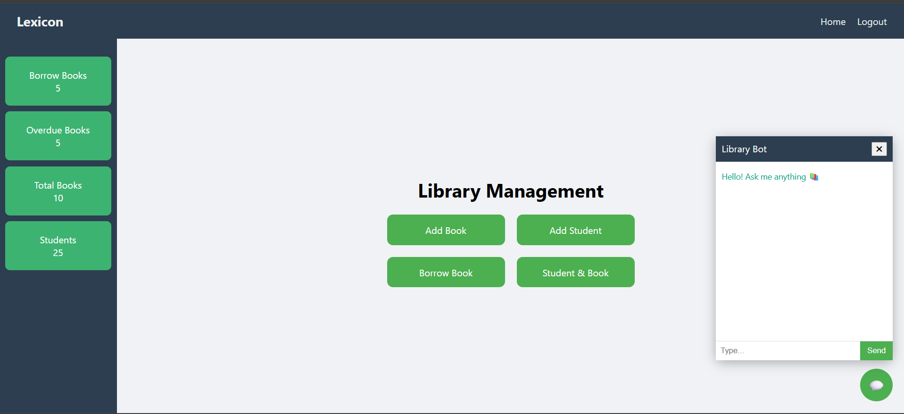

#  Library Management System

A web-based **Library Management System** built with **Django**, **HTML**, and **CSS** to help manage books, users, and borrowing activities efficiently.
Its has chat bot that interact with database in help get easily data using less clicks. 

##  Features

- Add, edit, and delete books
- Issue and return books
- User authentication (login/logout)
- dashboard
- Chat Bot
- Clean and responsive UI

##  Tech Stack

- **Backend**: Django (Python)
- **Frontend**: HTML, CSS 
- **Database**: SQLite ORM (default with Django)

##  Screenshots
  ## Login page

  ## Home page

  ## Add book page

  ## Add student page

  ## Borrow Book
 
  ## Borrow info 
  
  ## Chat Bot 
  

## ⚙️ Installation & Setup
 After download zip and extract zip in some folder ,now go to vs code and open terminal then follow this step
 
 ## Install dependencies
    pip install django
 ## Apply migrations
    python manage.py makemigrations 
    python manage.py migrate
 ## Run the server
    python manage.py runserver
Access the app
Open your browser and go to: http://127.0.0.1:8000/

username = librarian
password = librarian123
